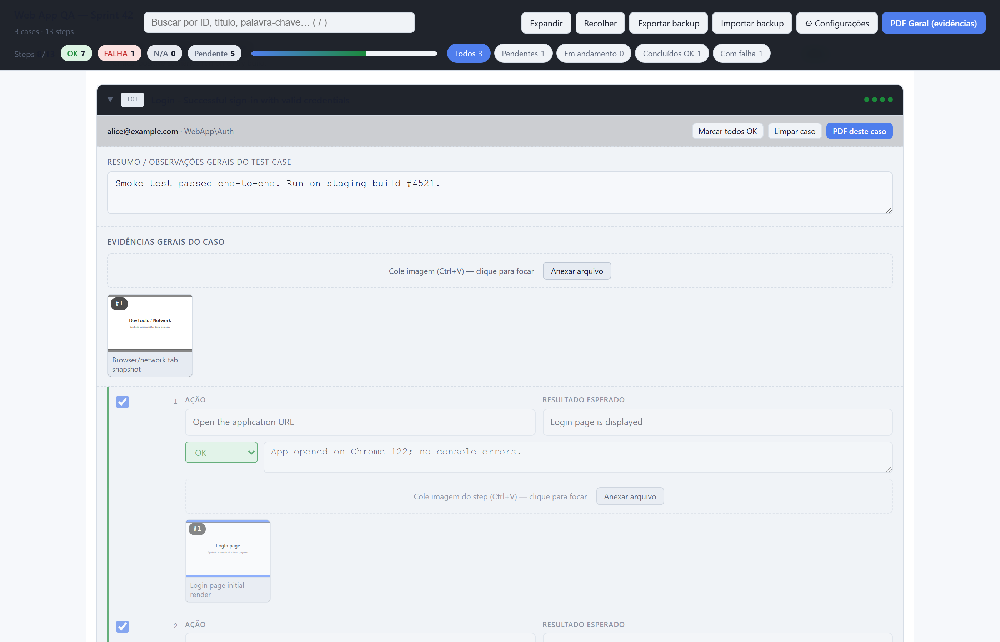
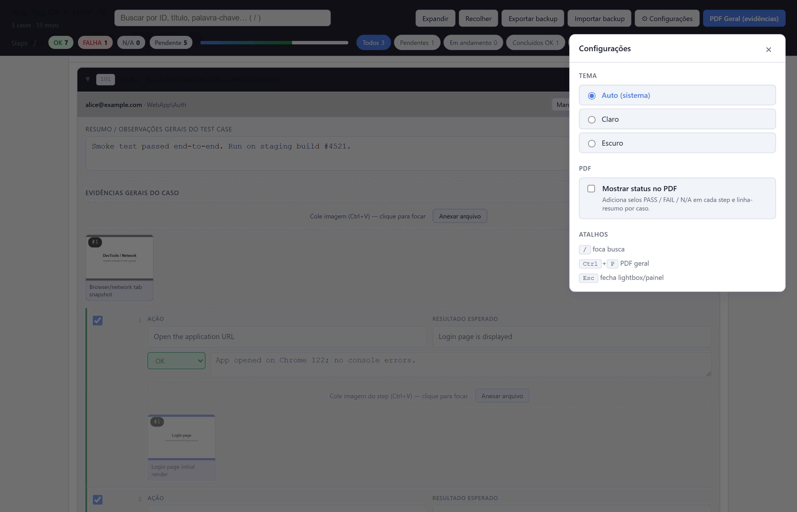

# tfs-test-runner

> Convert **Azure DevOps / TFS** test case `xlsx` exports into a self-contained **HTML test execution kit** with screenshot capture, status tracking, notes, and PDF evidence export. No server, works offline. Optional GPT translation.

[](https://github.com/luizhcrs/tfs-test-runner/actions/workflows/test.yml)
[](https://luizhcrs.github.io/tfs-test-runner/)
[](LICENSE)
[](https://www.python.org/downloads/)
[](README.pt-BR.md)

📖 **Full docs**: [luizhcrs.github.io/tfs-test-runner](https://luizhcrs.github.io/tfs-test-runner/) ([PT-BR](https://luizhcrs.github.io/tfs-test-runner/pt-BR/))

| Dark theme (default) | Light theme |
|---|---|
|  |  |

| Settings panel (theme + PDF options) | Case detail with evidence |
|---|---|
|  |  |

<details>
<summary><b>More screenshots</b> — failures filter, PDF evidence, PDF with status badges, full plan, mobile, empty state</summary>

<br>

| Filter "Failures" | PDF evidence (default) |
|---|---|
|  |  |

| PDF with status pills (toggle ON) | Mobile / narrow viewport |
|---|---|
|  |  |

| Empty state | Full plan (long screenshot) |
|---|---|
|  | [03-full-plan.png](docs/images/03-full-plan.png) |

</details>

## Quick start

```bash
git clone https://github.com/luizhcrs/tfs-test-runner.git
cd tfs-test-runner
pip install -e .

python examples/generate_sample.py
tfs-test-runner examples/sample.xlsx -o sample-out.html
# open sample-out.html in your browser
```

No API key required. The tester pastes screenshots (Ctrl+V) at each step, marks PASS/FAIL/N/A, writes notes, then clicks **PDF** for an evidence deliverable.

### No Azure DevOps? Use the blank template

Don't have an export? Download a [blank xlsx template](examples/blank-template.xlsx) (`python examples/generate_blank_template.py` regenerates it) and fill it manually — same schema as Azure DevOps' built-in **Test Plans → Export to Excel**.

## Common flags

```bash
# GPT translation (any language)
export OPENAI_API_KEY=sk-...
tfs-test-runner cases.xlsx --llm --lang pt-BR -o plan.html

# Phase grouping + custom title + logo
tfs-test-runner cases.xlsx \
    --phases examples/sample-phases.yaml \
    --title "Sprint 42 — Acceptance" \
    --logo company.png -o plan.html

# Show full CLI
tfs-test-runner --help
```

## Features

- Phase / case / step tree, search (`/`), filter chips, expand/collapse
- Per-step **PASS / FAIL / N/A**, notes textarea, paste/drop/pick screenshot
- Per-image captions, lightbox zoom
- **Per-case PDF** (evidence-only) and **full-plan PDF** with cover sheet
- **Settings panel** (gear icon): light/dark/auto theme + status-in-PDF toggle
- JSON backup/restore (state + images)
- Keyboard: `/` search, `Ctrl+P` PDF, `Esc` close lightbox/settings

> 💡 In the print dialog, **uncheck "Headers and footers"** so the browser doesn't inject `file:///…` and date/time at every page.

## Documentation

- [docs/USAGE.md](docs/USAGE.md) · [PT-BR](docs/USAGE.pt-BR.md) — full walkthrough for testers
- [docs/ARCHITECTURE.md](docs/ARCHITECTURE.md) · [PT-BR](docs/ARCHITECTURE.pt-BR.md) — pipeline, data shapes, design choices
- [CONTRIBUTING.md](CONTRIBUTING.md) — dev setup
- [CHANGELOG.md](CHANGELOG.md) — release notes

### YAML configs (examples in [`examples/`](examples/))

```yaml
# phases.yaml — group cases
phases:
  - id: p1
    title: "Phase 1 — Smoke"
    level: easy
    case_ids: ["101", "104"]
  - id: p2
    title: "Phase 2 — Failures"
    match: ["failure", "invalid", "error"]
```

```yaml
# glossary.yaml — refine LLM translation (optional)
preserve: ["Sign In", "Save", "Cancel"]
notes: "Domain: web QA. Tone: technical, imperative."
```

## Python API

```python
from tfs_test_runner import parse_xlsx, translate_cases, assign_phases, render

cases = parse_xlsx("cases.xlsx")
translate_cases(cases, backend="llm", target_lang="pt-BR")
render(assign_phases(cases), "plan.html", page_title="My Plan")
```

## Development

```bash
pip install -e .[dev]
pytest -q
```

CI matrix: Ubuntu / macOS / Windows × Python 3.10 / 3.11 / 3.12.

## License

[MIT](LICENSE) — © 2026 luizhcrs. PRs welcome.
