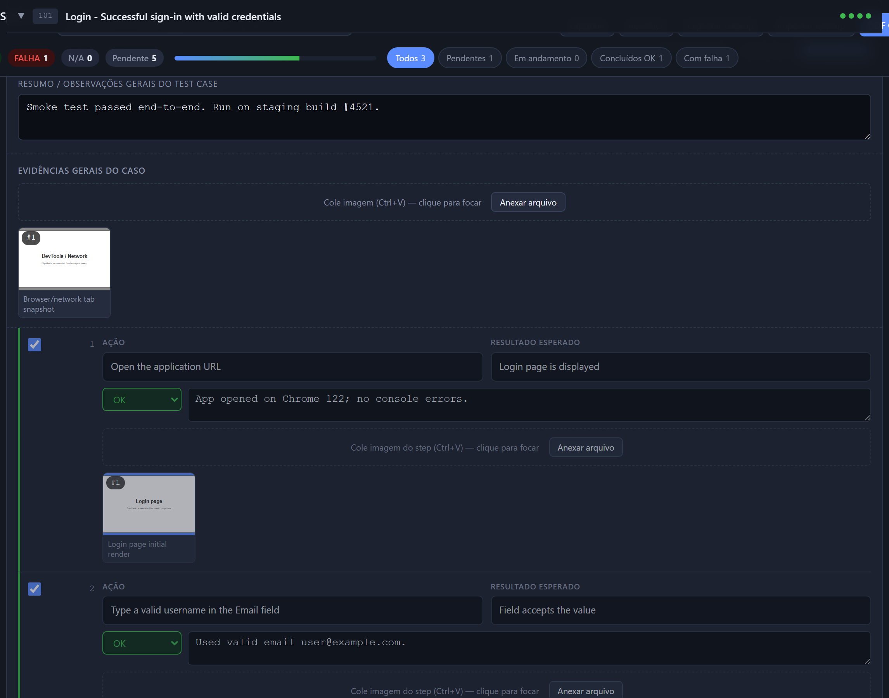
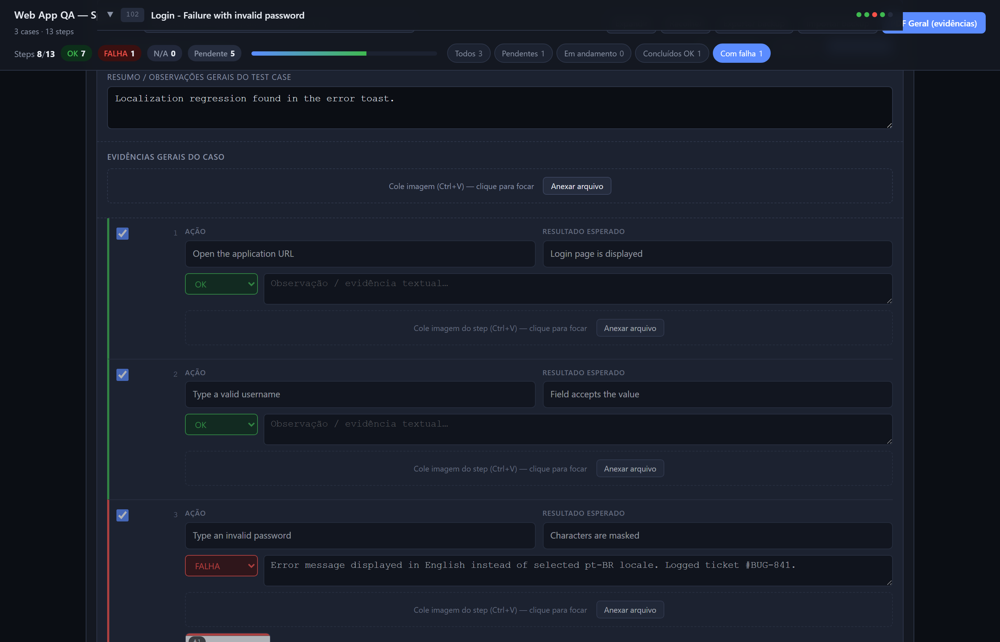
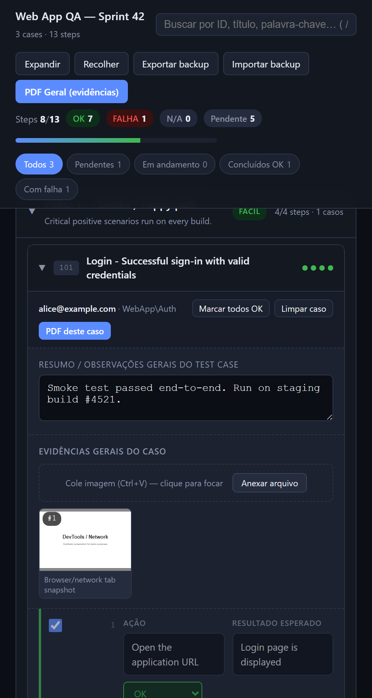

# tfs-test-runner

> Convert **Azure DevOps / TFS** test case `xlsx` exports into a self-contained **HTML test execution kit** with screenshot capture, status tracking, observation notes, and PDF evidence export. No server, works offline, zero config. Optional GPT translation to any language.

[](https://github.com/luizhcrs/tfs-test-runner/actions/workflows/test.yml)
[](LICENSE)
[](https://www.python.org/downloads/)
[](README.pt-BR.md)

## Screenshots

| Overview with progress + filters | Single case w/ evidence + status |
|---|---|
|  |  |

| Filter chips (Failures only) | Print / PDF evidence layout |
|---|---|
|  |  |

<details>
<summary><b>More screenshots</b> (full plan, narrow viewport, empty state)</summary>

| Empty state (right after build) | Narrow / mobile-ish viewport |
|---|---|
|  |  |

Full plan (long page screenshot): [03-full-plan.png](docs/images/03-full-plan.png)

</details>

## Why

If your team uses **Azure DevOps Test Plans** (or TFS, e.g. `*.tfs.<company>.net`), you can already export test cases and steps to xlsx. But running them by hand and assembling evidence — screenshots per step, status, notes, then bundling everything into a deliverable PDF — is tedious and error-prone.

`tfs-test-runner` takes that xlsx and produces a single HTML file you open in any browser. Testers paste screenshots step-by-step (Ctrl+V), mark PASS / FAIL / N/A, write notes, and at the end click one button to print a clean evidence PDF (per case or the whole plan). State is saved in `localStorage`; images in `IndexedDB`. Backup / restore as JSON.

## Quick start

```bash
git clone https://github.com/luizhcrs/tfs-test-runner.git
cd tfs-test-runner
pip install -e .

# Generate the sample xlsx (synthetic data) and build the HTML
python examples/generate_sample.py
tfs-test-runner examples/sample.xlsx -o sample-out.html

# Open sample-out.html in your browser
```

That's it. No API key, no translation, no extras.

## Common use cases

### Translate to Brazilian Portuguese with GPT
```bash
export OPENAI_API_KEY=sk-...
tfs-test-runner cases.xlsx --llm --lang pt-BR -o plan.html
```

### Translate to any language with a domain glossary
```bash
tfs-test-runner cases.xlsx \
    --llm --lang es \
    --glossary examples/sample-glossary.yaml \
    -o plan-es.html
```

### Group cases into phases
```bash
tfs-test-runner cases.xlsx \
    --phases examples/sample-phases.yaml \
    --title "Sprint 42 — Acceptance Tests" \
    -o sprint42.html
```

### Add a custom logo (appears on each case page in PDF mode)
```bash
tfs-test-runner cases.xlsx --logo company-logo.png -o plan.html
```

## What the HTML kit gives the tester

- **Phase / case / step tree** with collapsible sections
- **Search** (`/` to focus) and **filter chips** (Pending / In progress / OK / Failure)
- Per-step **PASS / FAIL / N/A** status, **notes textarea**, **screenshot paste zone** (Ctrl+V or click "Attach file")
- **Per-image captions** — click thumbnail, edit caption inline, appears in PDF
- **Per-case actions**: mark all PASS, clear case (state + images), **export this case as PDF**
- **Full plan PDF** with cover page (date + summary table by phase)
- **Backup / Restore JSON** — round-trips full state including image data URLs
- **Keyboard shortcuts**: `/` search, `Ctrl+P` general PDF, `Esc` close lightbox

## How the PDF looks

Per-case PDF mimics a clean evidence document:
- **Logo** (if `--logo` was set) at the top of each case page
- **Case title** in English
- **Sequence of [caption + screenshot]** blocks, one per step that has at least one image
- **Steps without screenshots are hidden** automatically
- **Page breaks per case** so cases never split awkwardly

> 💡 In the print dialog, **uncheck "Headers and footers"** — otherwise the browser injects `file:///…` and date/time at every page boundary.

## CLI reference

```text
Usage: tfs-test-runner [OPTIONS] INPUT_XLSX

  Generate single-file HTML test execution plan from Azure DevOps / TFS xlsx export.

Options:
  --version                Show the version and exit.
  -o, --output PATH        Output HTML path. Default: test-plan.html
  -f, --force              Overwrite output file if it already exists.
  --llm                    Translate via OpenAI GPT (needs OPENAI_API_KEY).
  --lang TEXT              Target language for --llm translation. [default: pt-BR]
  --model TEXT             OpenAI model when --llm is set. [default: gpt-4o-mini]
  --glossary PATH          YAML glossary to refine LLM translation (preserve terms,
                           domain notes).
  --logo PATH              Custom logo PNG for HTML header. Default: no logo.
  --phases PATH            YAML phase config to group cases.
  --title TEXT             Page title shown in browser tab and HTML header.
                           [default: Test Execution Plan]
  --dump-json PATH         Also write intermediate JSON for debugging.
  --help                   Show this message and exit.
```

## Expected xlsx schema

The parser detects columns by header name (case-insensitive, supports common aliases). Required columns: `ID`, `Work Item Type`, `Title`, `Step Action`. Optional: `Test Step`, `Step Expected`, `Area Path`, `Assigned To`, `State`.

Rows alternate: a row with `Work Item Type = Test Case` opens a new case; subsequent rows (typically with `Work Item Type` empty or `Shared Steps`) belong to that case as steps until the next test case appears. This matches the standard Azure DevOps **Test Plans → Export to Excel** layout.

## YAML phase config

```yaml
phases:
  - id: "p1"
    title: "Phase 1 — Smoke"
    level: easy            # easy | med | hard (cosmetic)
    desc: "Critical path."
    case_ids: ["101", "104"]

  - id: "p2"
    title: "Phase 2 — Failures"
    level: med
    desc: "Negative paths."
    match: ["failure", "invalid", "error"]    # case-insensitive substring on title
```

Cases not matched fall into an automatic **Others** phase appended at the end.

## YAML glossary config (LLM only)

```yaml
preserve:
  - "Sign In"
  - "Save"
  - "Cancel"
notes: |
  Domain: web QA. Tone: technical, imperative ("Click", "Type", "Verify").
```

`preserve` terms are added to the LLM system prompt and must be kept verbatim. `notes` is appended as free-text domain context.

## Python API

```python
from tfs_test_runner import parse_xlsx, translate_cases, assign_phases, render

cases = parse_xlsx("cases.xlsx")
translate_cases(cases, backend="llm", target_lang="pt-BR")
phases = assign_phases(cases)
render(phases, "plan.html", page_title="My Test Plan", logo="logo.png")
```

## Documentation

- [docs/USAGE.md](docs/USAGE.md) — end-to-end walkthrough for testers
- [docs/ARCHITECTURE.md](docs/ARCHITECTURE.md) — pipeline, data shapes, design choices
- [CONTRIBUTING.md](CONTRIBUTING.md) — dev setup and conventions
- [CHANGELOG.md](CHANGELOG.md) — release notes

## Architecture

```
tfs_test_runner/
├── parse.py        # xlsx → list[dict] (openpyxl, header-driven)
├── translate.py    # passthrough or LLM (OpenAI Chat Completions, JSON mode)
├── classify.py     # default 1-phase / YAML-driven grouping
├── render.py       # Jinja2 → single-file HTML, base64 logo, escaped JSON
├── cli.py          # Click-based CLI
├── template/
│   └── plano.html.j2   # CSS + JS + IndexedDB UI
└── assets/         # (empty by default; --logo is opt-in)
build.py            # convenience shim for `python build.py …`
examples/           # synthetic xlsx + YAML configs
tests/              # pytest suite (29 tests, parser/translator/classifier/render)
```

## Development

```bash
git clone https://github.com/luizhcrs/tfs-test-runner.git
cd tfs-test-runner
python -m venv .venv
source .venv/bin/activate    # Windows: .venv\Scripts\activate
pip install -e .[dev]
pytest -q
```

CI runs the test suite on Ubuntu / macOS / Windows × Python 3.10 / 3.11 / 3.12 plus a CLI smoke test against the generated sample.

## Roadmap (open to PRs)

- [ ] **Other LLM providers**: Anthropic Claude, local Ollama / llama.cpp.
- [ ] **CSV input** in addition to xlsx.
- [ ] **TestRail / Xray** importer adapters.
- [ ] **Multi-tester sync**: optional WebRTC / file-based merge for parallel execution.
- [ ] **Print mode toggle**: full vs evidence-only as a UI checkbox before printing.
- [ ] **Per-step time tracking** for execution analytics.

## Contributing

PRs welcome. Run `pytest` before pushing. Stick to the existing code style (no formatter enforced; reasonable consistency).

## License

[MIT](LICENSE) — © 2026 luizhcrs.

## Acknowledgements

Built to scratch a real itch: turning manual QA execution against Azure DevOps test plans into a low-friction, evidence-rich workflow without yet another SaaS. If it saves your team a few hours, give it a star ⭐.
