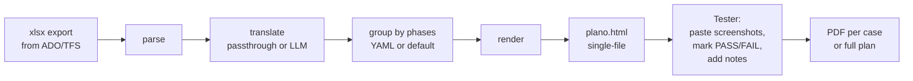
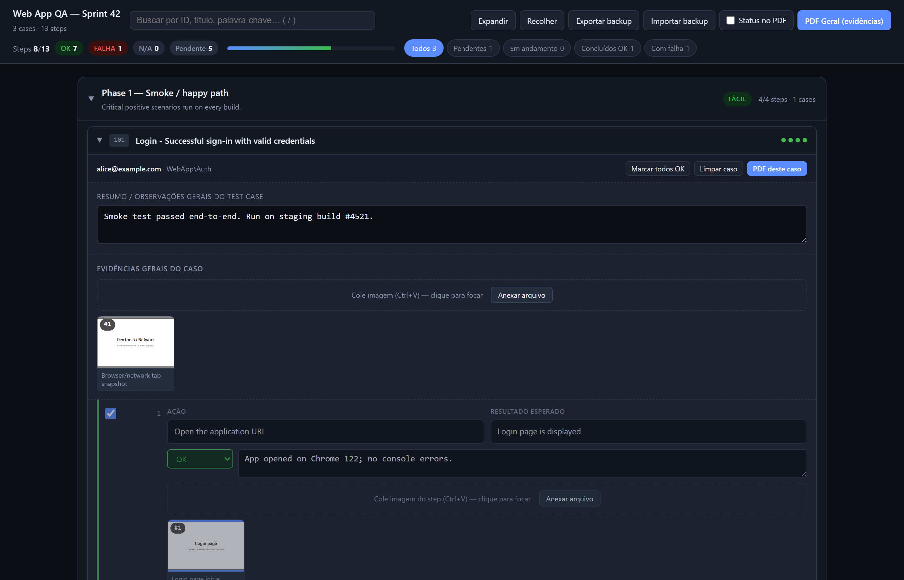
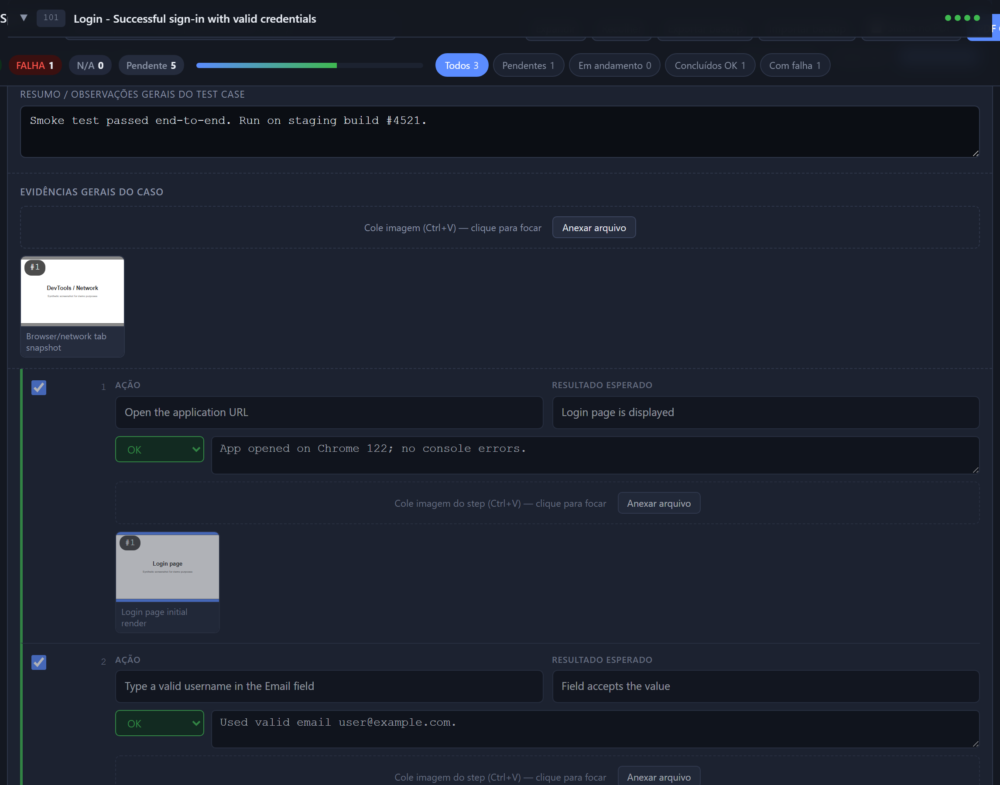
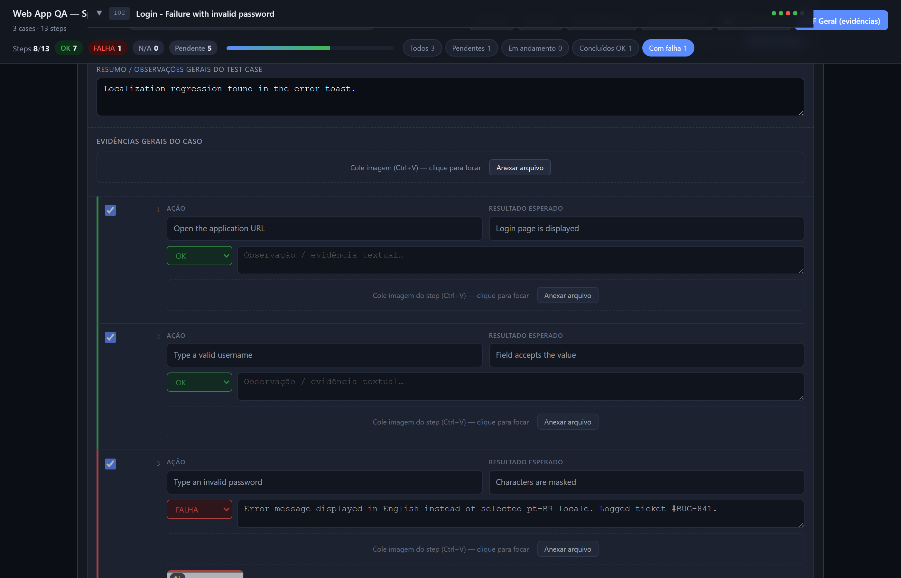
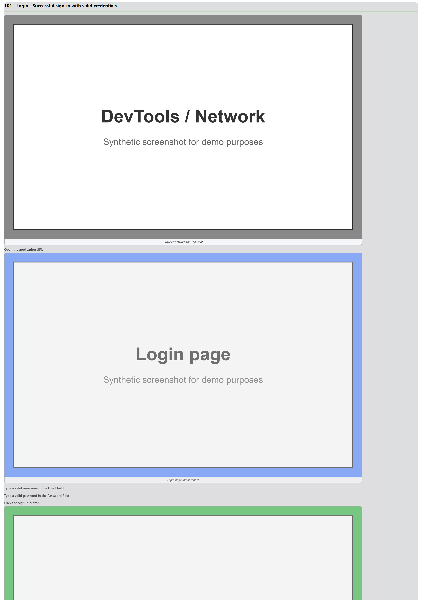
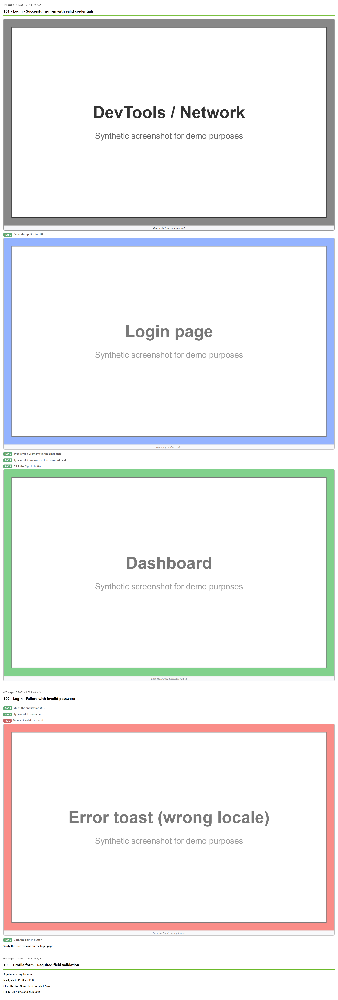
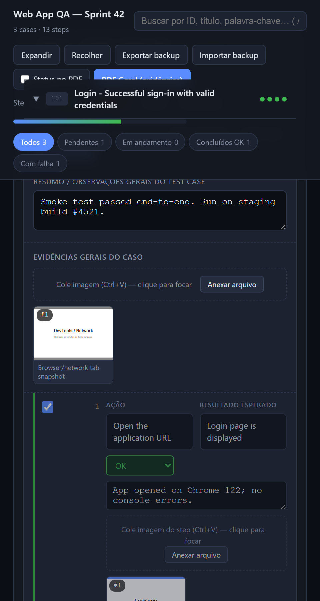
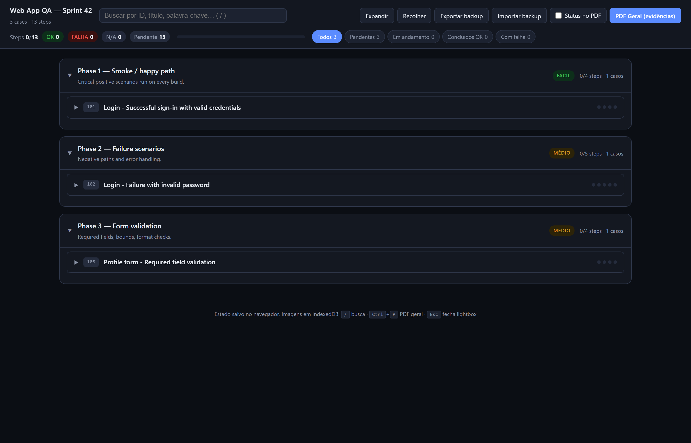

# tfs-test-runner

> **Convert Azure DevOps / TFS test case `xlsx` exports into a self-contained HTML test execution kit** with screenshot capture, status tracking, observation notes, and PDF evidence export. No server, works offline, zero config. Optional GPT translation to any language.

## What it does

Each stage is a pure function over plain dicts. Intermediate JSON dumpable via `--dump-json`.

## Why

If your team uses **Azure DevOps Test Plans** or **TFS** (e.g. `*.tfs.<company>.net`), you can already export test cases to xlsx. But running them by hand and assembling evidence — screenshots per step, status, notes, packaged as a deliverable PDF — is tedious and error-prone.

`tfs-test-runner` takes that xlsx and produces a single HTML file you open in any browser. Testers paste screenshots step-by-step (Ctrl+V), mark PASS / FAIL / N/A, write notes, then click one button to print a clean evidence PDF.

State persists in `localStorage` (text/status) and `IndexedDB` (images). Backup/restore as JSON. Zero server, zero auth.

## Get started

-   :material-rocket-launch:{ .lg .middle } **Quickstart**

    ---

    Install in 30 seconds, generate your first HTML kit from the synthetic sample.

    [:octicons-arrow-right-24: Quickstart](quickstart.md)

-   :material-cog:{ .lg .middle } **Usage**

    ---

    End-to-end walkthrough for testers running real plans.

    [:octicons-arrow-right-24: Usage guide](usage.md)

-   :material-tune:{ .lg .middle } **Configuration**

    ---

    YAML phase grouping, glossaries, custom logo, LLM models.

    [:octicons-arrow-right-24: Configuration](configuration.md)

-   :material-source-branch:{ .lg .middle } **Architecture**

    ---

    Pipeline, data shapes, design choices, and trade-offs.

    [:octicons-arrow-right-24: Architecture](architecture.md)

## Screenshots

| Overview with progress + filters | Single case w/ evidence + status |
|---|---|
|  |  |

??? note "More screenshots"

    | Filter "Failures" | PDF evidence (default) |
    |---|---|
    |  |  |

    | PDF with status pills (toggle ON) | Mobile / narrow viewport |
    |---|---|
    |  |  |

    | Empty state | Full plan (long screenshot) |
    |---|---|
    |  | [03-full-plan.png](images/03-full-plan.png) |

## Don't have an xlsx yet?

Two options:

1.  **Use the bundled synthetic sample** — `python examples/generate_sample.py` creates a fake plan to play with.
2.  **Use the blank template** — download [blank-template.xlsx](https://github.com/Luizhcrs/tfs-test-runner/raw/main/examples/blank-template.xlsx) and fill it manually. Same schema as Azure DevOps export.

[:material-download: Download blank template](https://github.com/Luizhcrs/tfs-test-runner/raw/main/examples/blank-template.xlsx){ .md-button .md-button--primary }
[:material-github: View on GitHub](https://github.com/Luizhcrs/tfs-test-runner){ .md-button }
