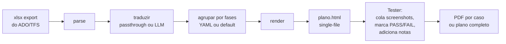

# tfs-test-runner

> **Converte exports `xlsx` de test cases do Azure DevOps / TFS em um kit HTML auto-contido** com captura de screenshots, controle de status, anotações e exportação de evidências em PDF. Sem servidor, funciona offline, zero configuração. Tradução opcional via GPT pra qualquer idioma.

## O que faz

Cada estágio é função pura sobre dicts. JSON intermediário dumpável via `--dump-json`.

## Por quê

Se seu time usa **Azure DevOps Test Plans** ou **TFS** (ex. `*.tfs.<empresa>.net`), você já consegue exportar test cases pra xlsx. Mas executar manualmente e juntar evidências — screenshots por step, status, notas, empacotar como PDF entregável — é tedioso e propenso a erro.

`tfs-test-runner` pega esse xlsx e gera um arquivo HTML único pra abrir em qualquer navegador. Os testers colam screenshots step-a-step (Ctrl+V), marcam PASS / FAIL / N/A, escrevem notas, depois clicam um botão pra imprimir um PDF de evidência limpo.

State persiste em `localStorage` (texto/status) e `IndexedDB` (imagens). Backup/restore como JSON. Sem servidor, sem auth.

## Comece aqui

-   :material-rocket-launch:{ .lg .middle } **Início rápido**

    ---

    Instale em 30 segundos, gere seu primeiro kit HTML do sample sintético.

    [:octicons-arrow-right-24: Início rápido](quickstart.md)

-   :material-cog:{ .lg .middle } **Uso**

    ---

    Walkthrough end-to-end pro tester rodando planos reais.

    [:octicons-arrow-right-24: Guia de uso](usage.md)

-   :material-tune:{ .lg .middle } **Configuração**

    ---

    Agrupamento YAML, glossários, logo customizado, modelos LLM.

    [:octicons-arrow-right-24: Configuração](configuration.md)

-   :material-source-branch:{ .lg .middle } **Arquitetura**

    ---

    Pipeline, formatos, decisões de design e trade-offs.

    [:octicons-arrow-right-24: Arquitetura](architecture.md)

## Screenshots

| Visão geral + filtros | Caso com evidências |
|---|---|
|  |  |

??? note "Mais screenshots"

    | Filtro "Com falha" | PDF de evidências (default) |
    |---|---|
    |  |  |

    | PDF com selos de status (toggle LIGADO) | Mobile / viewport estreito |
    |---|---|
    |  |  |

    | Estado vazio | Plano completo (screenshot longa) |
    |---|---|
    |  | [03-full-plan.png](../images/03-full-plan.png) |

## Não tem xlsx ainda?

Duas opções:

1.  **Sample sintético embutido** — `python examples/generate_sample.py` cria plano fake pra brincar.
2.  **Template em branco** — baixa [blank-template.xlsx](https://github.com/Luizhcrs/tfs-test-runner/raw/main/examples/blank-template.xlsx) e preenche manualmente. Mesmo schema do export Azure DevOps.

[:material-download: Baixar template em branco](https://github.com/Luizhcrs/tfs-test-runner/raw/main/examples/blank-template.xlsx){ .md-button .md-button--primary }
[:material-github: Ver no GitHub](https://github.com/Luizhcrs/tfs-test-runner){ .md-button }
